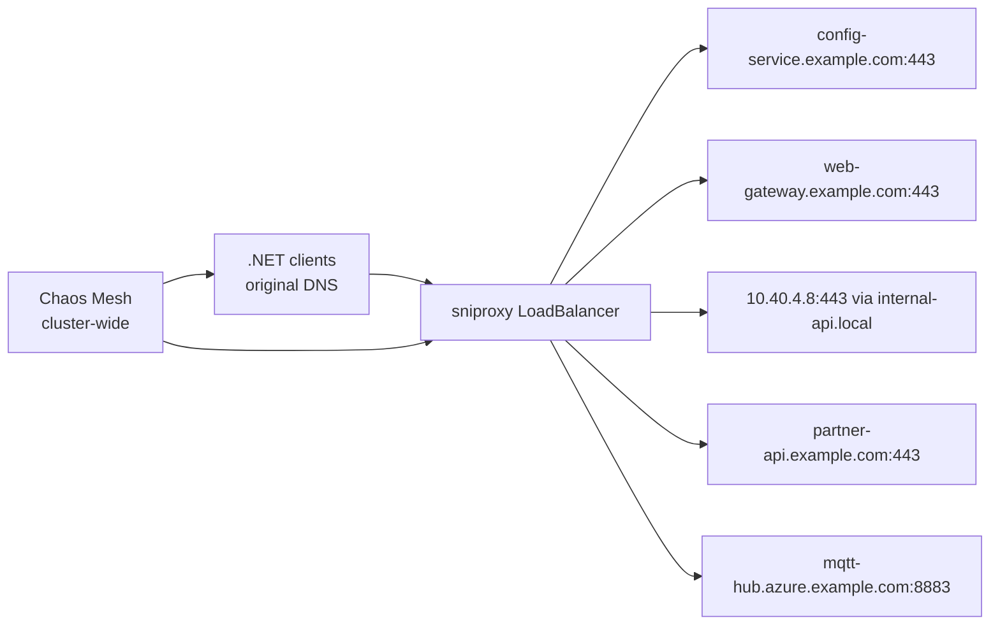

# Toxiproxy Replacement: sniproxy + Chaos Mesh

Replace many single-upstream Toxiproxy instances with one per-environment `sniproxy` plus cluster-wide Chaos Mesh for on-demand network fault injection.

## Architecture



## Included deliverables

- `Dockerfile` for a containerized sniproxy image.
- `config/sniproxy.conf` and Kubernetes manifests under `k8s/sniproxy/`.
- Chaos Mesh install and cleanup scripts under `scripts/`.
- NetworkChaos examples under `k8s/chaos-mesh/`.
- `chaos_client.py`, pytest fixtures, and example chaos tests.
- CI examples under `ci/examples/`.
- Setup, troubleshooting, and migration guides under `docs/`.

## Quick start

```bash
./scripts/install-chaos-mesh.sh
kubectl apply -f k8s/sniproxy/namespace.yaml
kubectl apply -f k8s/sniproxy/configmap.yaml
kubectl apply -f k8s/sniproxy/deployment.yaml
kubectl apply -f k8s/sniproxy/service.yaml
```

Full instructions: [`docs/SETUP.md`](docs/SETUP.md)

## Routing multiple DNS records

Add each hostname as its own line in the correct table:

```text
table https_hosts {
    config-service.example.com config-service.example.com:443
    web-gateway.example.com web-gateway.example.com:443
    internal-api.local 10.40.4.8:443
    partner-api.example.com partner-api.example.com:443
}

table mqtt_hosts {
    mqtt-hub.azure.example.com mqtt-hub.azure.example.com:8883
}
```

This keeps TLS end-to-end intact because `sniproxy` only inspects the SNI value and forwards raw TCP to the mapped upstream.

## Chaos experiments included

- Full disconnection: `k8s/chaos-mesh/networkchaos-partition.yaml`
- 100 ms latency: `k8s/chaos-mesh/networkchaos-latency.yaml`
- 30% packet loss: `k8s/chaos-mesh/networkchaos-packet-loss.yaml`
- Timeout simulation: `k8s/chaos-mesh/networkchaos-timeout.yaml`

## Test automation

Install pytest and run the example suite:

```bash
pip install -r requirements-chaos.txt
pytest tests/test_chaos_examples.py -q
```

The tests use dry-run mode by default when you instantiate `ChaosMeshClient(dry_run=True)`. In CI or a live cluster, set `CHAOS_MESH_DRY_RUN=0`.

## Operations

- Setup: [`docs/SETUP.md`](docs/SETUP.md)
- Troubleshooting: [`docs/TROUBLESHOOTING.md`](docs/TROUBLESHOOTING.md)
- Migration from Toxiproxy: [`docs/MIGRATION.md`](docs/MIGRATION.md)
